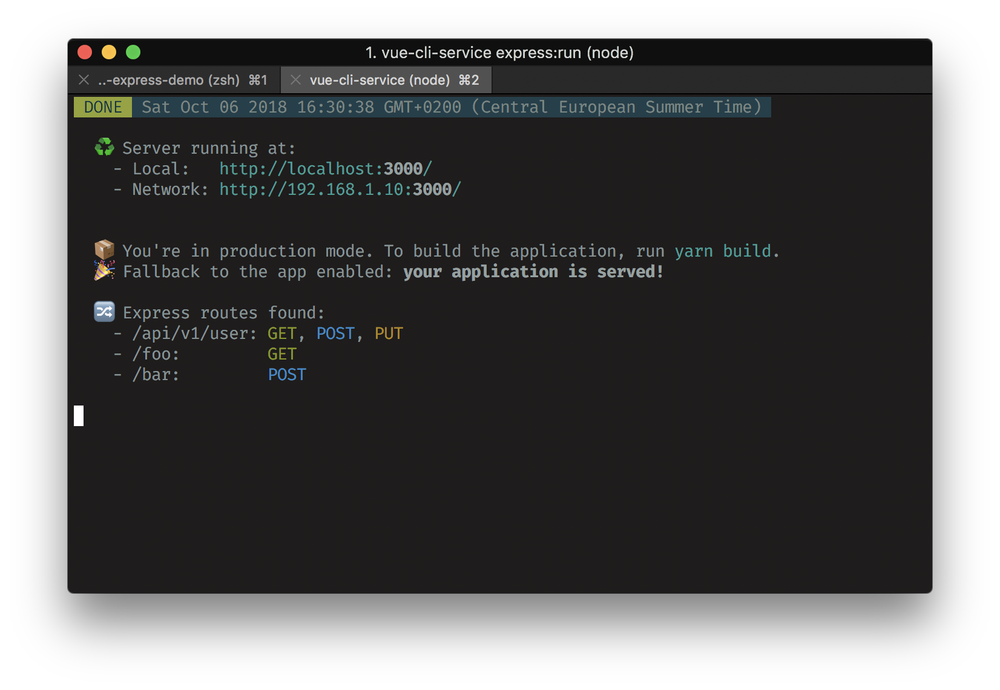

# vue-cli-plugin-express

[ ](https://www.npmjs.com/package/vue-cli-plugin-express)
[](https://github.com/vuejs/vue-cli)

**:rocket: Add an API in your Vue application in 2 minutes!**

This is a vue-cli 3.x plugin to add an Node Express server in your Vue project.

<br>



<br>

**:star: Features:**

- Included fully customizable Express Server:
  - Just add your api routes into your project (with import/export support) without thinking to something else.
  - Optional automatic fallback to the Vue app, to serve both the api and the application with only one command. 
  - Optional socket.io support.
- (soon) Included optional example routes and components.

## Table of contents

- [Getting started](#getting-started)
- [Usage](#usage)
- [Injected Commands](#injected-commands)
- [Configuration](#configuration)
- [Use your app in production](#use-your-app-in-production)

---

## Getting started

:warning: Make sure you have vue-cli 3.x.x:

```
vue --version
```

If you don't have a project created with vue-cli 3.x yet:

```
vue create my-new-app
```

Navigate to the newly created project folder and add the cli plugin:

```
cd my-new-app
vue add express
```
Soon:
*:information_source: An example `APIExample.vue` component will be added into your sources if you chose to include the examples.*

## Usage

To start your server for development purpose, use this commands:

```
yarn express
```

The server will be automatically restarted when a change is detected.

You just then have to start the app:

```
yarn serve
```

To run the server only once for production use, run:
```
yarn express:run
```

**Updating `vue-cli-plugin-express` will update the Express server service :+1:**

## Injected Commands

- **`vue-cli-service express:watch`**

  Run the Express server with info from `./srv` and watch the files to restart itself automatically.

- **`vue-cli-service express:run`**

  Run the Express server with info from `./srv` once.

## Configuration

The Express Server can be configured via the `pluginOptions` in `vue.config.js`:

```js
module.exports = {
  // Other options...
  pluginOptions: {
    // Express-related options
    express: {
        shouldServeApp: true,
        serverDir: './srv',
      },
    },
  },
}
```

## Use your app in production

Move `@vue/cli-service` from `devDependencies`to `dependencies`.

Execute the following commands:
```bash
yarn build
yarn express:run
```

For most of cloud hosting services, you can add a `start` command that will be triggered automatically:
```json
{
  "scripts": {
    "start": "yarn express:run" 
  }
}
```
